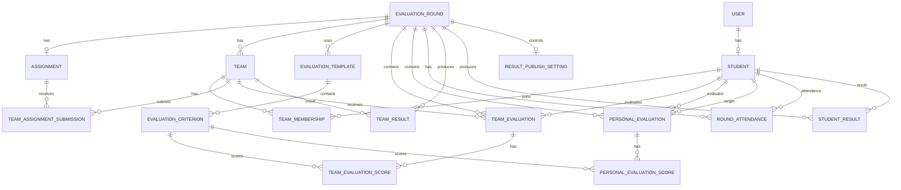

# Mermaid ERD — 실제 모델 기준

```mermaid
erDiagram
    USER ||--o| STUDENT : has
    EVALUATION_ROUND ||--o| ASSIGNMENT : has
    EVALUATION_ROUND ||--o{ TEAM : has
    TEAM ||--o{ TEAM_MEMBERSHIP : has
    STUDENT ||--o{ TEAM_MEMBERSHIP : joins

    ASSIGNMENT ||--o{ TEAM_ASSIGNMENT_SUBMISSION : receives
    TEAM ||--o{ TEAM_ASSIGNMENT_SUBMISSION : submits

    EVALUATION_ROUND ||--o{ EVALUATION_TEMPLATE : uses
    EVALUATION_TEMPLATE ||--o{ EVALUATION_CRITERION : contains

    EVALUATION_ROUND ||--o{ TEAM_EVALUATION : contains
    STUDENT ||--o{ TEAM_EVALUATION : evaluates
    TEAM ||--o{ TEAM_EVALUATION : receives
    TEAM_EVALUATION ||--o{ TEAM_EVALUATION_SCORE : has
    EVALUATION_CRITERION ||--o{ TEAM_EVALUATION_SCORE : scores

    EVALUATION_ROUND ||--o{ PERSONAL_EVALUATION : contains
    STUDENT ||--o{ PERSONAL_EVALUATION : evaluator
    STUDENT ||--o{ PERSONAL_EVALUATION : target
    PERSONAL_EVALUATION ||--o{ PERSONAL_EVALUATION_SCORE : has
    EVALUATION_CRITERION ||--o{ PERSONAL_EVALUATION_SCORE : scores

    EVALUATION_ROUND ||--o{ ROUND_ATTENDANCE : has
    STUDENT ||--o{ ROUND_ATTENDANCE : attendance

    EVALUATION_ROUND ||--o{ TEAM_RESULT : produces
    TEAM ||--o{ TEAM_RESULT : result

    EVALUATION_ROUND ||--o{ STUDENT_RESULT : produces
    STUDENT ||--o{ STUDENT_RESULT : result

    EVALUATION_ROUND ||--o| RESULT_PUBLISH_SETTING : controls
```

- 공통 `EVALUATION_RESPONSE`는 실제 구현에 없으므로 제거했습니다.
- 별도 `TeamSeed` 엔터티는 실제 구현에 없으므로 ERD에서 제거했습니다.
