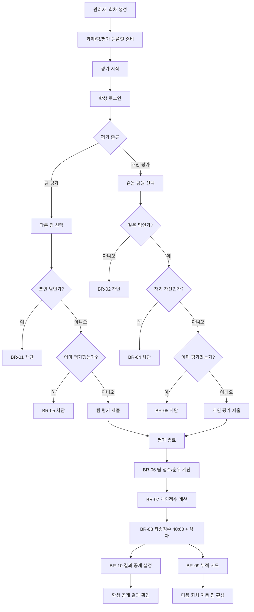

# 업무 흐름 다이어그램

```mermaid
flowchart TD
    A[관리자: 회차 생성] --> B[과제/팀/평가 템플릿 준비]
    B --> C[평가 시작]
    C --> D[학생 로그인]
    D --> E{평가 종류}
    E -->|팀 평가| F[다른 팀 선택]
    F --> G{본인 팀인가?}
    G -->|예| H[BR-01 차단]
    G -->|아니오| I{이미 평가했는가?}
    I -->|예| J[BR-05 차단]
    I -->|아니오| K[팀 평가 제출]

    E -->|개인 평가| L[같은 팀원 선택]
    L --> M{같은 팀인가?}
    M -->|아니오| N[BR-02 차단]
    M -->|예| O{자기 자신인가?}
    O -->|예| P[BR-04 차단]
    O -->|아니오| Q{이미 평가했는가?}
    Q -->|예| R[BR-05 차단]
    Q -->|아니오| S[개인 평가 제출]

    K --> T[평가 종료]
    S --> T
    T --> U[BR-06 팀 점수/순위 계산]
    U --> V[BR-07 개인점수 계산]
    V --> W[BR-08 최종점수 40:60 + 석차]
    W --> X[BR-10 결과 공개 설정]
    X --> Y[학생 공개 결과 확인]
    W --> Z[BR-09 누적 시드]
    Z --> AA[다음 회차 자동 팀 편성]
```
